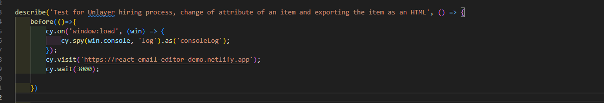
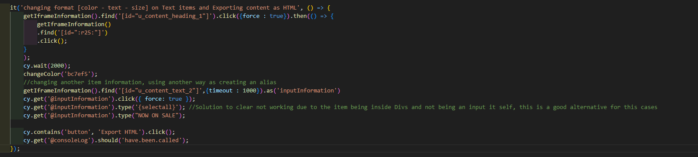
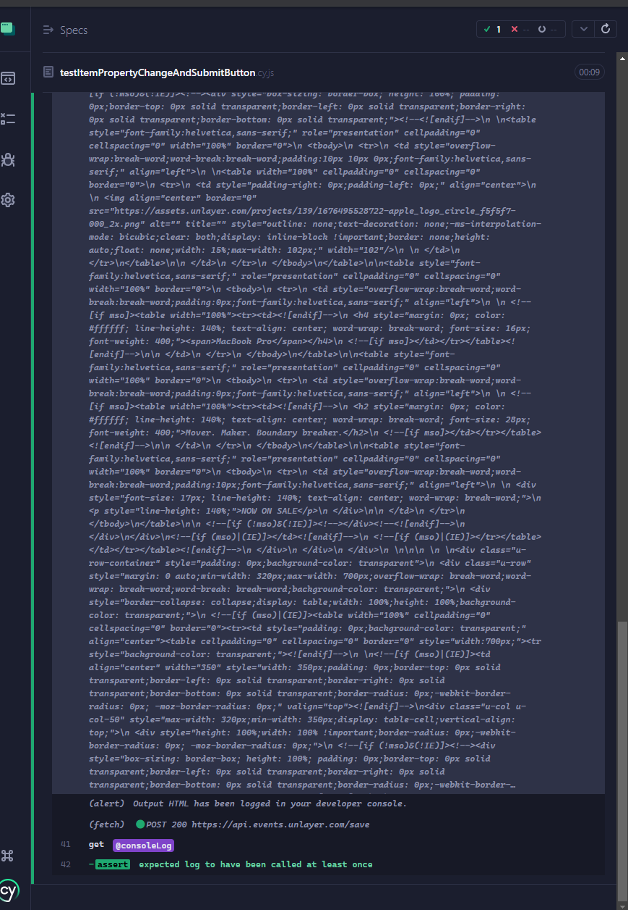

# Cypress test Sample

Cypress easy test example for the following instructions: 

    Instructions:

Please complete the following tasks to the best of your ability. You are allowed to use any
relevant resources, including documentation and online references. Your solutions will be
evaluated based on correctness, efficiency, adherence to best practices, and overall quality of
the submission.
In this assignment, you will use our Unlayer web-based email editor to customize and
modify email content. The tool allows you to easily change text properties, add new content,
and generate HTML code for email templates. Your task is to explore these features and
make specific adjustments to better understand how email design can be personalized and
fine-tuned.
You can access the email editor here: Email Editor

Assignment:

1. Using Cypress, open the provided email editor.
2. Select any portion of the existing text.

3. Change any of the text properties (e.g., font, color, or size).

4. Once you’re done, click on the ‘Export HTML’ button to verify the changes in the generated code.

● Pay attention to the organization and cleanliness of the generated code for
maintainability and scalability.

● Document your work on GitHub with a proper README file explaining your
approach, how to run and any key points of interest.


## Installation

Copy the repository on your machine, then make sure that you have Cypress installed:

Check your cypress version:

```bash
    npx cypress --version
```


Installation for Cypress:

```bash
    npm install cypress --save-dev
```
Then open and Run cypress:

```bash
    npx cypress open
```

Then code is findable on:
```
cypress\e2e\testItemPropertyChangeAndSubmitButton.cy.js
```
## Approach 

First, we set up a `Before` function, where we establish all the steps that will run before our test.



We need to set up the following code so Cypress can read and return logs from the console and check the console log.

(More about how `spy` works can be found on the [Spy documentation](https://docs.cypress.io/api/commands/spy)).

```Cypress
cy.on('window:load', (win) => {
    cy.spy(win.console, 'log').as('consoleLog');
});
```

Next, we proceed with creating the test, making its purpose as clear as possible:



As shown in the test, we created multiple functions instead of placing everything in a single test. This approach was aimed at:

-Making the code as readable as possible
-Following the DRY (Don't Repeat Yourself) principle
-Ensuring the code is scalable

Since all items were inside an iframe, they were not directly accessible by using the ID, path, or classes of the elements. To interact with the items, we needed to go into the iframe. -By using the find() function, we created a reusable way to access the iframe every time, instead of repeating the code multiple times.

Keynote: The use of a timeout helps avoid the overuse of cy.wait(), as the timeout is item-specific and not process-wide.

```Cypress
function getIframeInformation(){
    return cy.get('iframe',{timeout : 1000})
    .its('0.contentDocument.body')  
    .should('not.be.empty')
    .then(cy.wrap);
};

```

Next, we created a function to change the text color by receiving the hexadecimal code. This allows us to reuse the function with any text and any color, as long as we provide a valid hexadecimal value:

```Cypress
function changeColor(hexaDecimalColor){
    getIframeInformation().find('[id="color-picker-trigger"]',{timeout : 1000}).click({ force: true })
    getIframeInformation().contains('label', 'hex',{timeout : 1000}).siblings('input').clear({ force: true }).type(hexaDecimalColor); //finding the hexa input based on label as id changes depending on the click
};
```

Finally, in the test, we used two methods to interact with the parts of the email editor. The first method uses find() based on the ID of each item:

```Cypress
getIframeInformation().find('[id="u_content_heading_1"]')
```

The second method uses the creation of an alias:

(Aliases are very useful for dealing with complex elements, allowing us to reference them easily for any subsequent actions.)

```Cypres
cy.get('@inputInformation')
```

KeyNote: 

Even though it might look like we're taking a shortcut, it's actually pretty common in Cypress to run into situations where we can't interact with a component (like clicking, clearing, or typing) because of things like the parent component or the way the website is built. In these cases, using { force: true } can help us in the testing process.

```Cypress
cy.get('@inputInformation').click({ force: true });
```

At the end, we verified that after clicking the "Generate HTML" button, a log is generated. This ensures that the HTML email code has been successfully created.

```Cypress
cy.contains('button', 'Export HTML').click();
cy.get('@consoleLog').should('have.been.called');
```

Ending on a success test:
